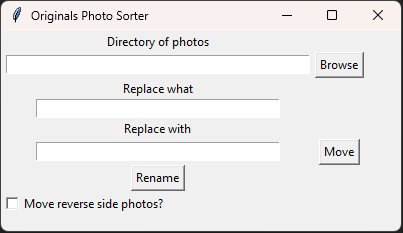

# Fastfoto Sorter
GUI python script for Windows to move original photos from enhanced ones - used with Epson Fastfoto. Currently hard coded to only work with .jpgs. Useful when you want to keep your original photos but not have duplicates when viewing them.
Also includes a file renaming feature. Useful for when you don't like what you've named the batch and would like to rename them.

# How to use
Make sure you have Python 3 (with Tkinter) installed, download picturemovergui.py and double click to run it. Click Browse to browse to your directory of photos, or paste in a directory. Choose to move reverse sides of photos or not. Press Move. The command prompt will have an output log. 

To use the renamer, make sure you have a directory in the 'Directory of photos' field, then just type what part of the filename you want to replace in the 'Replace what' field, and type what you want to replace it with in the 'Replace with' field and click Rename. It will replace whatever you put in the 'Replace what' field no matter where it is in the filename. If you leave the 'Replace with' field blank, it will simply remove the 'Replace what' text from the filename. 

This function is not recursive, that is: it will not rename anything in subsequent folders. You will need to browse to that directory and click Rename again to rename those photos.

# How it works
Fastfoto can generate enhanced versions of your photos as well as scan the back sides. These files get appened a suffix with _a and _b respectively. This program, given a directory of .jpgs, will automatically move the original copies to their own folder called "Originals" and the user can choose to move the B sides or not.
